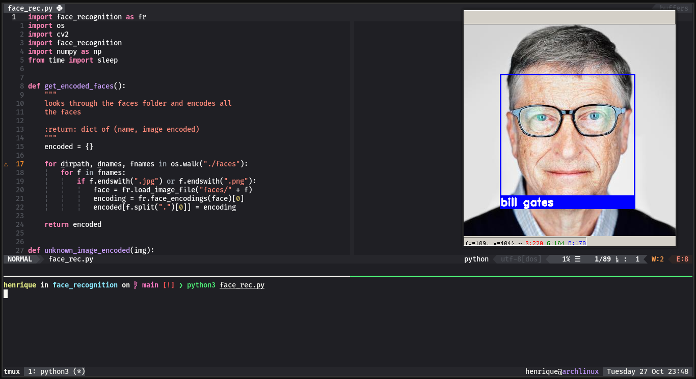

# Face Recognition
Python script for facial recognition using the OpenCV library. This method uses haar cascades to identify objects.

To learn more about how haar cascades work, suggest that you read the original article by [(P. Viola & M. Jones, 2001)](https://www.cs.cmu.edu/~efros/courses/LBMV07/Papers/viola-cvpr-01.pdf)
or watch a video explaining how the cascades of haar works https://youtu.be/WfdYYNamHZ8.


## :construction_worker: Installation
#### Requirements
- Python 2.7 or Python3.3+
- cmake
- dlib
- face_recognition
- numpy
- opencv-python

Installing cmake on debian derivatives:

`apt install cmake`

Installing cmake on macOS:

`brew install cmake `

Then install the necessary libraries using `pip3` (or `pip2` for Python 2):

```bash
pip3 install -r requirements.txt
```

## :runner: Usage
Finally we will understand how the script is structured and we will put it to work.

In the project folder they contain another folder called faces, this folder has pictures of faces of famous people, the photos are named with the proper name of each person.


After adding all the face photos inside the face folder, we will point out in our script which image we want you to identify it for, we will call the classify_face function and pass as parameter the image path (in this case the image is in the same directory where the file that is being executed, so we just pass the name of the image).


Finally we run our script and we will have the following result.



## :bug: Issues
Feel free to ** register a new problem ** with a respective title and description in the [Face Recognition](https://github.com/henriquebeckmann/face_recognition/issues) repository. If you've found a solution to your problem, ** I'd love to review your pull request **!

## :closed_book: License

Released in 2020.
This project is under the [MIT license](https://github.com/henriquebeckmann/i_am_learning/blob/main/LICENSE).
